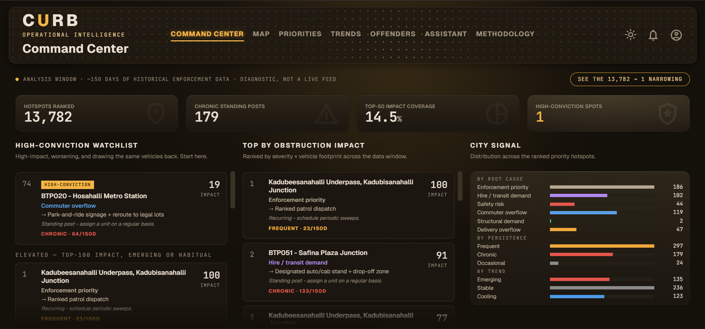
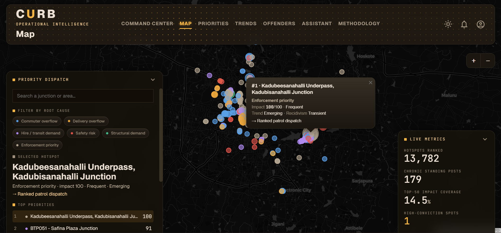
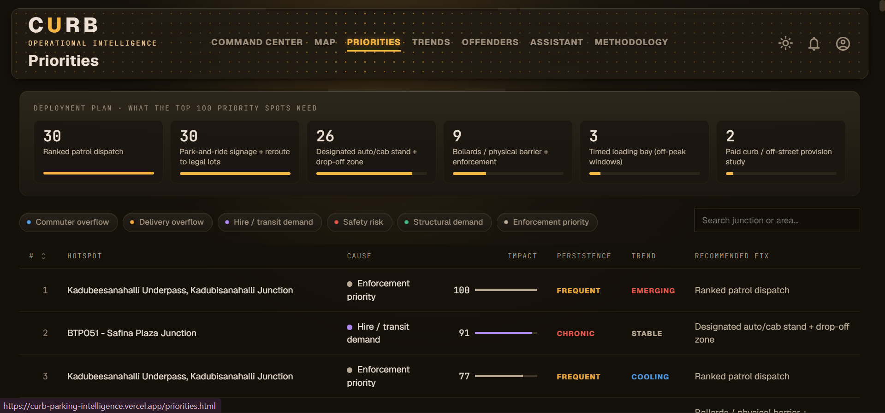
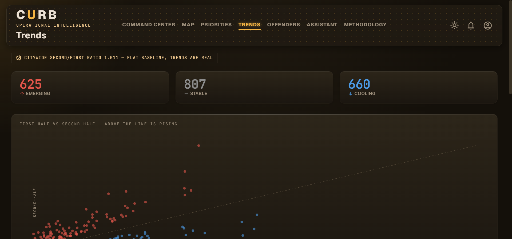
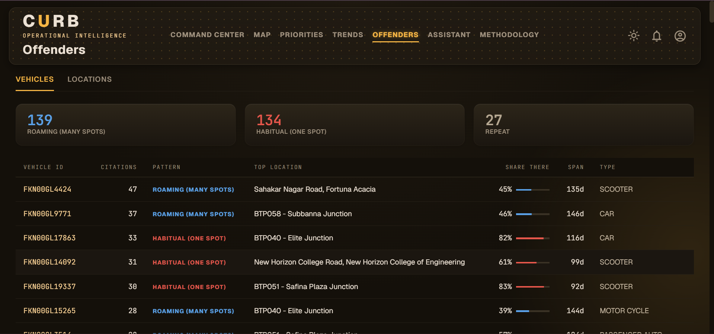
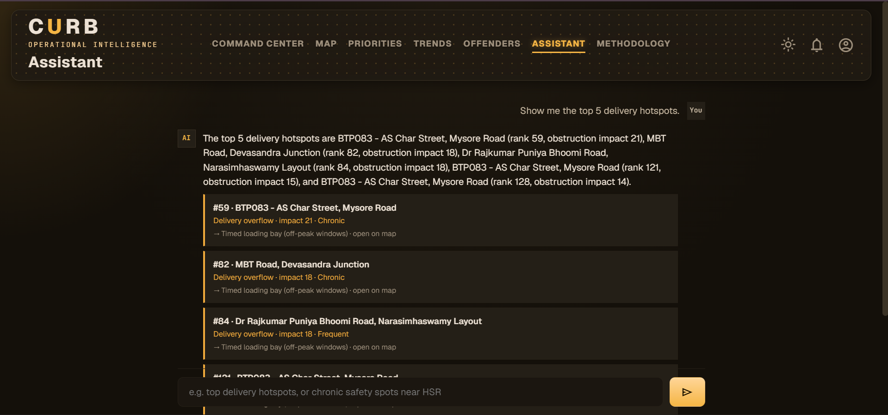
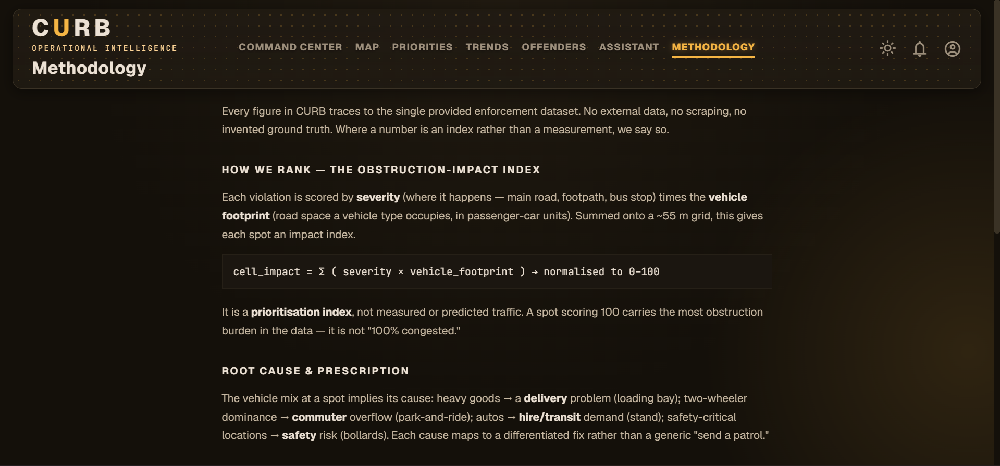
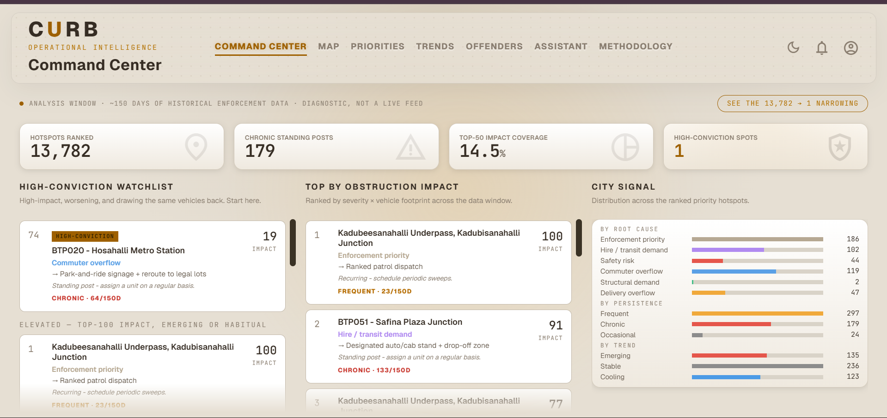
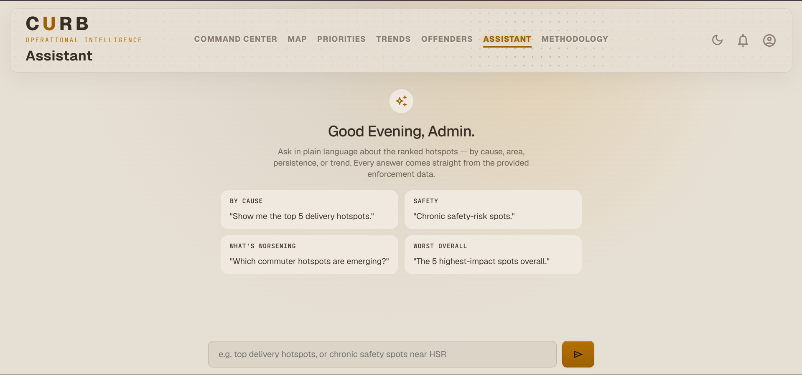

<div align="center">

# 🅒 CURB — Curb Intelligence System

### From 13,782 hotspots to one decision.

**Root-cause intelligence for parking-induced congestion in Bengaluru — built entirely from the provided enforcement dataset.**

[](#)
[](#)
<br>
[](#)
[](#)
[-B08AF0?style=flat-square&labelColor=14100A)](#)
[](https://curb-parking-intelligence.vercel.app)

**[🔗 Live demo](https://curb-parking-intelligence.vercel.app)** · **[🎞️ Demo video](https://youtu.be/hxzj0ZNhiNA)** · **[📊 Pitch deck](docs/CURB_Ppt.pptx)** · **[🧾 Methodology](https://curb-parking-intelligence.vercel.app/methodology.html)**

</div>

---

## Overview

Bengaluru's traffic police already know **where** people park illegally — every violation is logged and geo‑tagged. What they don't have is which of those spots actually **chokes traffic**, **why**, or **what fix** each one needs. Officers get a flat list of violations; planners get nothing prescriptive.

**CURB reframes the problem:** every illegal park is a *demand signal* for kerb space. Read the violations that way, and each hotspot tells you what the kerb is being asked to do — and how to fix it. CURB is a **reasoning layer above enforcement**: it ranks every spot by its obstruction impact, classifies the root cause from the vehicle mix, prescribes a differentiated fix, and narrows the whole city down to the single spot worth acting on first.

> **The headline:** out of **13,782** hotspot cells, exactly **one** is simultaneously top‑impact, worsening, *and* repeat‑heavy. CURB shows its work all the way down to that decision.

---

## Key features

| | Feature | What it does |
|---|---|---|
| 🗺️ | **Hotspot map** | Every spot plotted by root cause and impact, with cause/persistence/trend filters, search, a collapsible dispatch dock, and light/dark map tiles. |
| 📋 | **Dispatch board** | A ranked, sortable, filterable priority list of hotspots. |
| 🔎 | **Hotspot profile** | Click any spot, anywhere, for one consolidated drawer: impact, the *why* behind its cause, persistence, trend, recidivism, and the prescribed fix. |
| 🪜 | **The narrowing funnel** | An interactive `13,782 → 500 → 100 → 32 → 1` walk‑down — hover any stage to see the spots inside it. |
| 🧰 | **Deployment plan** | The top‑100 spots grouped by the action they need (patrol / park‑and‑ride / loading bay / bollards …). |
| 📈 | **Trends & offenders** | Retrospective emerging‑vs‑cooling analysis and anonymised repeat‑offender intelligence. |
| 💬 | **GenAI assistant** | Ask in plain language; answers are grounded **strictly** on the provided data, with a deterministic offline fallback. |

---

## Screenshots

| Command Center | Operational map |
|:--:|:--:|
|  |  |
| **Priorities & deployment plan** | **Trends** |
|  |  |
| **Repeat-offender intelligence** | **GenAI assistant** |
|  |  |
| **Methodology** | **Intro** |
|  |  |

**Light mode** — every screen supports a full light / dark theme toggle.

| Command Center (light) | Assistant (light) |
|:--:|:--:|
|  |  |

---

## How it works

CURB runs as a deterministic batch pipeline that produces a static, data‑driven frontend.

```
Provided CSV  →  Python pipeline (pandas)  →  Ranked JSON outputs  →  Static site (+ serverless assistant)
```

### 1. The obstruction‑impact index *(the differentiator)*

Each ~55 m grid cell is scored by **how much it obstructs traffic**, not by how many tickets it has:

```
cell impact  =  Σ ( violation severity  ×  vehicle footprint )      → normalised 0–100
```

| Severity — *where it happens* | weight | | Footprint — *road space (PCU)* | weight |
|---|---|---|---|---|
| Main road / crossing | 3.0 | | Scooter / 2‑wheeler | 0.4 – 0.5 |
| Double parking | 2.5 | | Auto | 0.8 |
| Bus stop / school / hospital | 2.0 | | Car | 1.0 |
| Wrong side / no‑parking | 1.5 | | Goods / van | 1.2 – 1.5 |
| Footpath | 1.2 | | Bus / lorry / HGV | 3.0 – 3.5 |

A bus blocking a crossing outweighs a scooter on a footpath. The footprint factors adapt the traffic‑engineering **Passenger Car Unit (PCU)** concept to *stationary* obstruction. These weights are **transparent, self‑defined constants in `config.py`** — a formula applied to the provided data, never fitted to or loaded from anything external. It is a **prioritisation index, not measured traffic.**

### 2. Root cause → prescribed fix

The vehicle mix at each hotspot is classified into a root cause, and each cause maps to a standard intervention:

| Root cause | Signal in the data | Prescribed fix |
|---|---|---|
| Commuter overflow | Two‑wheelers dominate | Park‑and‑ride + reroute |
| Delivery overflow | Goods‑vehicle share high | Timed loading bay |
| Hire / transit demand | Autos & cabs cluster | Designated stand + drop‑off |
| Safety risk | Crossing / school / footpath | Bollards + enforcement |
| Structural demand | High volume, all types | Paid / off‑street provision |
| Enforcement priority | Recurring, no dominant type | Ranked patrol dispatch |

> The recommended fix is CURB's **rules‑based inference** from the vehicle mix — a prescription, not a field that came with the data.

### 3. The narrowing — `13,782 → 1`

| Stage | Count | Filter |
|---|---:|---|
| Grid cells with a violation | **13,782** | — |
| Ranked priority hotspots | **500** | 48.5% of total obstruction impact |
| Top‑impact spots | **100** | 22% of impact |
| …that are also emerging | **32** | getting worse, not just bad |
| …and also habitual | **1** | same vehicles keep returning |

The one: **Hosahalli Metro Station** — high‑impact **and** worsening **and** repeat‑heavy. The most defensible place to act first.

---

## The data

All figures trace back to a **single provided enforcement dataset** — no external data.

- **~298K** violation records · **100%** geo‑tagged · **~150‑day** window · 54 stations
- Cleaned to **248,376** usable records → aggregated onto a ~55 m grid → **13,782** ranked hotspot cells
- **27,971** repeat‑detection vehicles (anonymised) inform recidivism analysis
- The unreliable hour‑of‑day field is **deliberately unused**; the relative *spatial* signal is what we trust

---

## Tech stack

- **Pipeline:** Python · pandas · numpy · scikit‑learn (deterministic, reproducible)
- **Frontend:** vanilla HTML / CSS / JS · Leaflet + CARTO tiles · a warm‑amber operational‑console theme with full light/dark support
- **Assistant:** a Vercel serverless function calling Google **Gemini**, grounded on a bundled top‑hotspots file, with a deterministic client‑side fallback
- **Hosting:** static site + serverless function on **Vercel**; the Python pipeline is a batch step (run locally / scheduled), not a live server

---

## Repository structure

```
curb/
├── config.py                 # all weights & thresholds — transparent constants
├── run.py                    # entry point: full chain + frontend regeneration
├── requirements.txt
│
├── src/                      # the analysis pipeline
│   ├── data_loader.py        # read + clean + parse the provided CSV
│   ├── hotspots.py           # impact model + ~55 m grid clustering + naming
│   ├── rootcause.py          # root-cause labels + recommended fixes
│   ├── prioritizer.py        # ranking, coverage, deployment grouping
│   ├── offenders.py          # repeat-offender (recidivism) intelligence
│   ├── trends.py             # retrospective emerging/cooling analysis
│   ├── intelligence.py       # high-conviction narrowing + summary
│   ├── webexport.py          # turns outputs/ into the site's data bundle
│   └── pipeline.py           # orchestrates the stages
│
├── notebooks/                # 01–06: a readable walkthrough of each stage
├── outputs/                  # generated JSON (consumed by webexport)
├── docs/                     # methodology notes, LLM-use approval, pitch deck
│
├── site/                     # ✅ the live frontend (deployed) — see below
│   ├── index.html            # Command Center
│   ├── map.html  priorities.html  trends.html  offenders.html
│   ├── assistant.html        # GenAI assistant
│   ├── methodology.html
│   ├── assets/               # curb.css · curb-nav.js · curb-app.js · curb-data.js
│   ├── api/assistant.js      # Vercel serverless Gemini endpoint
│   └── dev-server.js         # zero-dependency local server (static + /api)
│
├── frontend/                 # ⚠️ legacy Next.js prototype — superseded by site/
└── legacy/                   # earlier single-file dashboard
```

> **Note:** the production frontend is **`site/`**. `frontend/` and `legacy/` are earlier iterations kept for history.

---

## Getting started

### Option A — view the frontend (fastest)
Open **`site/index.html`** directly in a browser. (Needs internet for map tiles and fonts. The assistant runs in offline‑fallback mode without a server.)

### Option B — run locally with the live AI assistant
```bash
cd site
cp .env.example .env          # then add your key:  GEMINI_API_KEY=...
node dev-server.js            # Node 18+  →  http://localhost:3000
```
A free Gemini key is available at <https://aistudio.google.com/app/apikey>. The terminal prints `AI mode: LIVE (Gemini)` when the key is detected. Without a key, the assistant uses the deterministic, data‑grounded fallback.

### Option C — reproduce the analysis from raw data
```bash
pip install -r requirements.txt          # Python 3.10+
# place the provided dataset at  data/violations.csv
python run.py                            # full chain → outputs/ → regenerates site/ data
```
The chain runs `pipeline → prioritizer → offenders → trends → intelligence → webexport`. Flags: `python run.py path/to.csv`, `--site <folder>`, `--no-web`. Notebooks `01`–`06` walk through each stage interactively.

### Deploy (Vercel)
Set **Root Directory = `site`**, add an env var **`GEMINI_API_KEY`**, and **redeploy** after setting it. Verify with [`/api/assistant?q=worst 5 spots`](https://curb-parking-intelligence.vercel.app/api/assistant?q=worst%205%20spots) returning `"source":"gemini"`. See [`site/DEPLOY.md`](site/DEPLOY.md).

---

## Honest by design

CURB is built to be trusted — and picked apart:

- **Provided dataset only.** No external data; severity & footprint weights are self‑defined, transparent constants.
- **An index, not traffic.** Impact is a 0–100 *prioritisation* index, never a measured percentage of congestion.
- **Retrospective, not a forecast.** Trends describe the data window; the unreliable hour‑of‑day field is unused.
- **A prescription, not a label.** The recommended fix is a rules‑based inference from the vehicle mix.
- **AI phrases, never invents.** The assistant only rephrases results already computed from the data — no web, no external retrieval. This LLM use was **approved in writing by the organisers** (see `docs/`).
- **Privacy‑respecting.** Repeat‑offender analysis uses anonymised detections for aggregate targeting, never owner identification.
- **Fully reproducible.** Re‑run the pipeline on new data and the entire site regenerates from the output.

---

## Roadmap

- **MapmyIndia basemap** on the operational map (sponsor integration, at the finale).
- **Scheduled refresh** — ingest each new month of enforcement data automatically.
- **City‑agnostic** packaging — any city with geo‑tagged enforcement data can run the same pipeline.
- On‑demand recompute — let an operator upload a fresh extract and watch the analysis rebuild.

---

## Team

**Team CURB**

| Member | GitHub |
|---|---|
| **Arpit Raj** | [@arpitraj18](https://github.com/arpitraj18) |
| **Kanan Kotwani** | [@kanankotwani28](https://github.com/kanankotwani28) |

A balanced build across the full stack — data & backend (pipeline, ranking, root‑cause logic), frontend & design (the operational console), and analysis & methodology (the calculations, honesty guardrails, and compliance).

<!-- Screenshots are wired in the Screenshots section above. Place these 10 PNGs in docs/screenshots/:
     command-center.png · map.png · priorities.png · trends.png · offenders.png · assistant.png · methodology.png · splash.png
     command-center-light.png · assistant-light.png -->

---

<div align="center">
<sub>Built for Gridlock 2.0 · Problem Statement 1 · Bengaluru Traffic Police. Data provided by the organisers; used under the hackathon's terms.</sub>
</div>